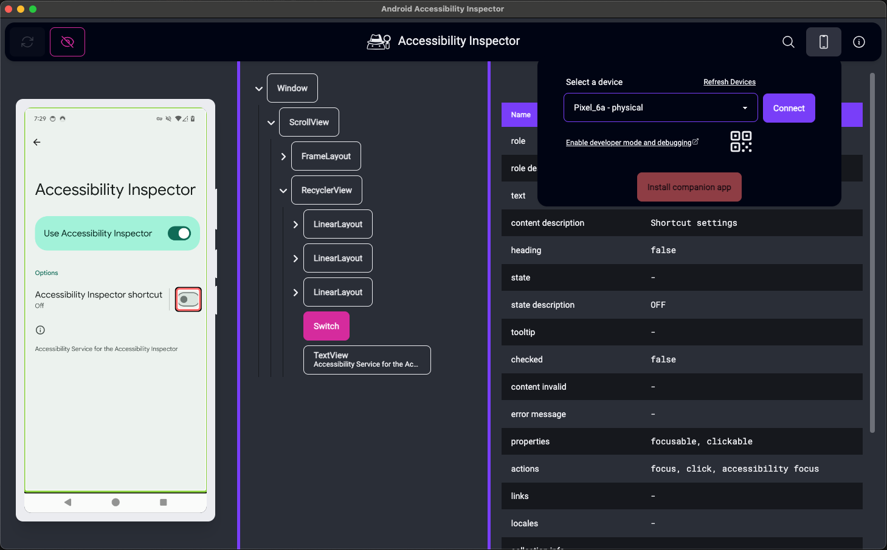
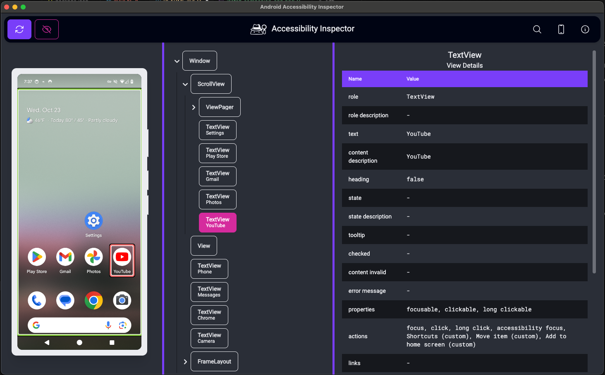
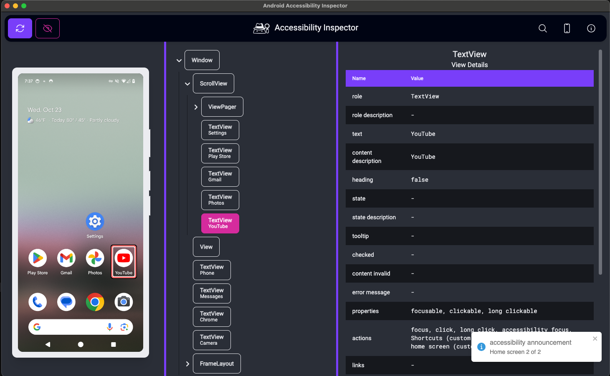
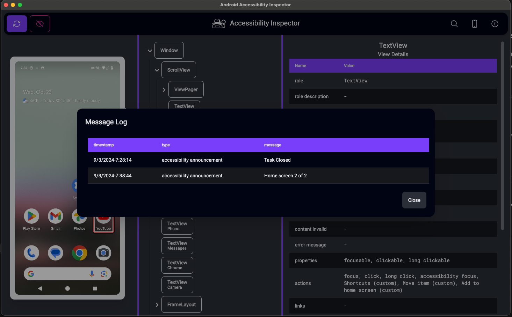

# Android Accessibility Inspector App

This is a front end for connecting to and displaying the accessibility node tree provided by the [Accessibility Inspector Service](https://github.com/jwlilly/Accessibility-Inspector-Service) installed on a physical device or Android virtual machine. 

## Installing Companion App
This project contains a signed app for the Accessibility Inspector Service that installs as an accessibility service. The app can be installed after connecting the device to the application, and a button will appear if it detects that the service app is not installed. After the service app is installed on the device, this app will attempt to start the accessibility service using ADB commands, forward the required 38301 port so that the service can be reached at ws://127.0.0.1:38301/, and trigger a capture of the accessibility node tree. After the first install, you may need to open the app manually on the device and allow notifications. The notifications are necessary due to the requirement of a background service running. 

## Capturing Accessibility Tree
Clicking the refresh tree button will trigger a capture of the accessibility node tree. The node tree and screenshot will be displayed. The screenshot can be clicked to highlight the corresponding accessibility node. Since multiple nodes can have overlapping bounds, the app attempts to figure out which node to select based on the node that has the smallest bounds that is currently under the mouse cursor. 

## Announce for Accessibility
The app will automatically show any announcement made using [View.announceForAccessibility()](https://developer.android.com/reference/android/view/View#announceForAccessibility(java.lang.CharSequence)). This can be tested using the Google Home screen and moving to another home screen. 

A full log of announcements can be found by selecting the "Logs" button. This will display a dialog with a table of the announcements and the time they were generated.

## New in version 2.0

* Light and dark mode: when the app is launched, it will default to the system theme. Theme can be changed under the view menu. Future versions will preserve the setting
* Better toggle for showing views that are marked as not important for accessibility: The toggle beside the refresh button will force the app to show information for views that have been marked as not important for accessibility. 
* Support for multiple devices: the previous version only allowed one device to be connected at a time. The latest version adds a selector so that you can pick a device to inspect. **A device must be chosen before you can click the refresh button**
* Proper tree view: this version contains a proper tree view for navigating the accessibility node tree. This makes it easier to understand the hierarchy of the view structure
* Message log: all "announceForAccessibility()" messages are now logged in the message log dialog so you can find them after the notification disappears
* Wifi pairing: If your computer and the device are on the same network, you can now pair the device using Wifi debugging by scanning a QR code on the device selection panel

## Tips for accessibility

* When searching for a piece of text, screen reader users can navigate by graphic or image to quickly move through the list of nodes that contain the search result. This is because a small badge is added to the nodes in the tree view to indicate that a node contains text in the search.
* The app is divided into 4 sections: primary navigation, screenshot region, node tree region, and view details region. After selecting a node, navigating by landmark or region for screen reader users will quickly move you over to the view details pane
* Animations have been added to a little bit of visual flair. For those that are sensitive to animations, they can be disabled by setting your operating system to reduce motion. More information can be found here: [prefers-reduced-motion - CSS: Cascading Style Sheets | MDN](https://developer.mozilla.org/en-US/docs/Web/CSS/@media/prefers-reduced-motion)
